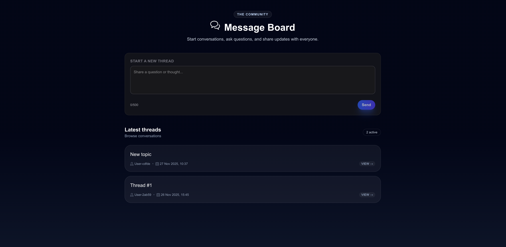

# Message Board – Full‑Stack Test Assignment

This repository implements a real‑time message board where users can start new threads and post replies without refreshing the page. The system is split into a KeystoneJS GraphQL backend (`backend/`) and a Next.js + Apollo Client frontend (`frontend/`), connected via GraphQL queries, mutations, and subscriptions.



## Requirements Coverage

- **Messaging system** – Users can create top‑level threads and reply to existing threads. Both actions persist to the database and update the UI immediately.
- **User session management** – A lightweight session helper stores a UUID in `localStorage`, mirrors it in the backend (`UserSession` list), and uses it as the message author identifier. No third‑party auth setup is required.
- **Real-time updates** – The backend exposes a `messageAdded` GraphQL subscription implemented with `graphql-ws`. The frontend subscribes to the thread being viewed and merges incoming replies into the Apollo cache so all open clients stay in sync.
- **Tech stack** – Frontend is TypeScript + React function components/hooks (Next.js). Backend is KeystoneJS with a SQLite database. All data access is via GraphQL queries/mutations/subscriptions, and data persists on disk (`backend/keystone.db`).

## Project Structure

```
backend/
  keystone.ts        # Keystone config, GraphQL schema extension, websocket server
  schema.ts          # Lists: Message, UserSession, relations & hooks
  pubsub.ts          # Simple PubSub utility for subscriptions
  schema.graphql     # Generated GraphQL schema snapshot
frontend/
  src/app/           # Next.js routes (home listing + thread detail)
  src/components/    # CreateThreadForm, ReplyForm, shared UI
  src/lib/           # Apollo client, GraphQL documents, session helper
```

## Prerequisites

- Node.js 18+ (Keystone and Next.js align with Active LTS)
- npm 9+ (ships with Node 18)

No external services are required; everything runs locally with the bundled SQLite database.

## Setup & Installation

Install dependencies for both workspaces:

```bash
cd backend
npm install

cd ../frontend
npm install
```

> Tip: keep two terminals open—one for the backend and one for the frontend—so both dev servers can run simultaneously.

## Running the Backend (Keystone + GraphQL API)

```bash
cd backend
npm run dev
```

- Starts Keystone on **http://localhost:3000** (REST + GraphQL).
- GraphQL Playground: http://localhost:3000/api/graphql
- Subscriptions are served over `ws://localhost:3000/api/graphql`.
- Database: `keystone.db` (SQLite file in `backend/`).

Keystone watches for schema changes and regenerates types automatically. The first run will create the SQLite file and seed tables as soon as you create data via GraphQL or the UI.

## Running the Frontend (Next.js App)

```bash
cd frontend
npm run dev
```

- Serves the UI on **http://localhost:3001**.
- Uses Apollo Client configured to talk to the backend’s GraphQL endpoint and websocket subscription server.
- Hot reload is enabled for both pages (`/` thread list, `/thread/[id]` detail view).

Make sure the backend is running before starting the frontend; otherwise Apollo will surface network errors for queries/mutations/subscriptions.

## Usage Guide

1. Open http://localhost:3001 — the landing page lists recent threads and shows the “Start a new thread” form.
2. Post a new message. A local session is created automatically the first time you interact with the form.
3. Click into any thread to view the full conversation and post replies.
4. Open the same thread in a second browser tab or another device; replies will appear instantly via the `messageAdded` subscription.

## GraphQL Overview

Key operations (all defined under `frontend/src/lib/graphql/`):

- `GET_THREADS` – lists top‑level `Message` records (threads).
- `GET_THREAD_WITH_REPLIES` – fetches a single thread along with its replies.
- `CREATE_THREAD` / `CREATE_REPLY` – mutations used by the forms.
- `MESSAGE_ADDED_SUBSCRIPTION` – pushes new replies per thread.
- `CREATE_USER_SESSION` / `FIND_SESSION_BY_IDENTIFIER` – manage anonymous user sessions.

## Common Tasks

| Task                      | Command                       |
| ------------------------- | ----------------------------- |
| Start backend dev server  | `cd backend && npm run dev`   |
| Build backend             | `cd backend && npm run build` |
| Start frontend dev server | `cd frontend && npm run dev`  |
| Lint frontend (Next)      | `cd frontend && npm run lint` |

## Troubleshooting

- **Subscription connection fails** – Ensure the backend is running on port 3000, and no firewall is blocking `ws://localhost:3000/api/graphql`.
- **Database locked / schema mismatch** – Stop the backend, delete `backend/keystone.db`, and restart. Keystone will recreate the schema.
- **GraphQL errors about missing types** – Run `npm install` in both folders to make sure `@types/*` dependencies are in place.

## Next Steps / Possible Enhancements

- Replace the lightweight session helper with first‑class auth (NextAuth, social login, etc.).
- Add pagination, reactions, or rich text formatting to threads/replies.
- Deploy the stack (e.g., Vercel frontend + Render/Fly backend) with PostgreSQL.
